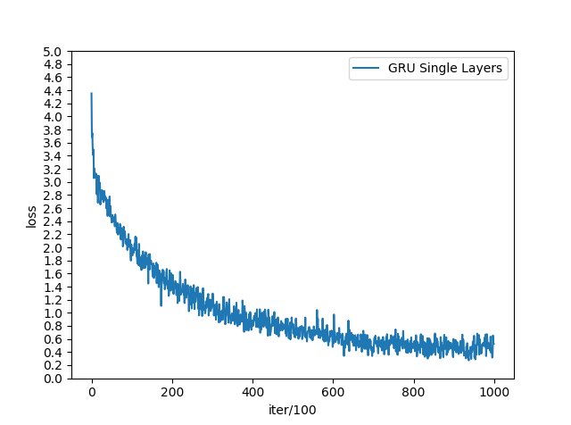

# nmt-pytorch
Pytorch based implementation of a seq2seq machine translation model. This implementaton is based on two following papers.
- Ilya Sutskever, Oriol Vinyals, Quoc V. Le **Sequence to sequence learning with neural networks**
- Dzmitry Bahdanau, KyungHyun Cho, Yoshua Bengio∗ (2016) **Neural machine translation by jointly learning to align and translate** 

#### Dataset Description

The data for this project is a set of many thousands translation pairs from one language to another. Download the data from here (https://www.manythings.org/anki/)

#### Hardware Configuration

Training was performed on Google Colaboratory platform which provides free access to GPUs. GPU Config -
Tesla P100-PCIE-16GB having 2496 CUDA cores and 16GB GDDR5 VRAM.

#### Model Description

Encoder-Decoder with attention mechanism
 
 Model variants (architecture of both encoder and decoder)
 - Single layer GRU (23M paremeters)
 - Single layer LSTM
 - 5-layered GRU
 - 5-layered LSTM
 
 #### How to use (For replicating or for your own experiments)
 
Clone the entire repo. (It includes English to French dataset)
```
git clone -l -s git://github.com/pashupati98/nmt-pytorch.git cloned-repo
cd cloned-repo
ls
```
Default setting is for French to English translation with single layer LSTM based encoder-decoder architecture having attention mechanism. Run everything (Training and Evaluation) with just one command.
```
python main.py
```

 #### Comperative performance 
 To be updated further
 
 
 
 #### Individual performance
 1 : Model with single layer of GRU
 
 Model Training process
 
 
 
 
 Evaluation (Attention Map)
 
 
 
 
 2 : Model with single layer of LSTM
 
 Model Training process
 
 
 
 
 
 Evaluation (Attention Map)
 
 
 
 
**Conclusion** - Model has learned pretty good for small sentences. It can be futher improved by training it on large corpus. 